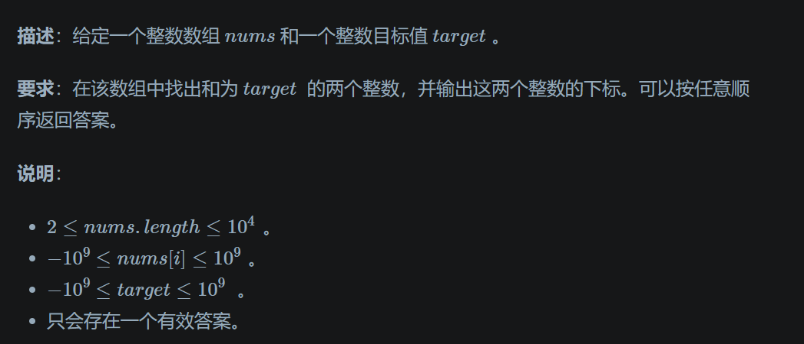
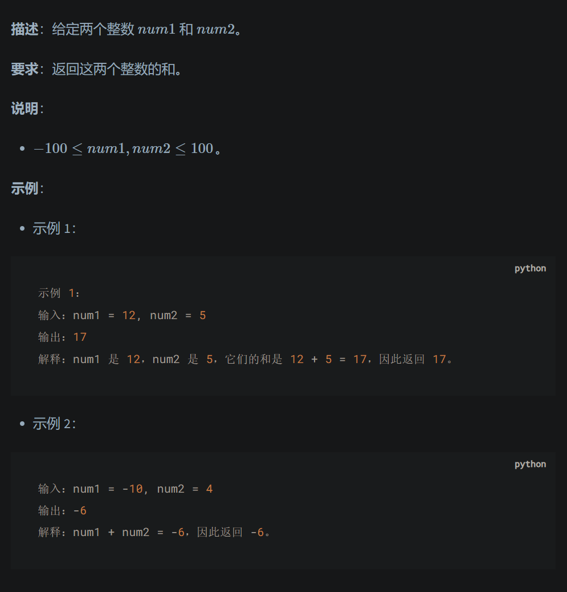
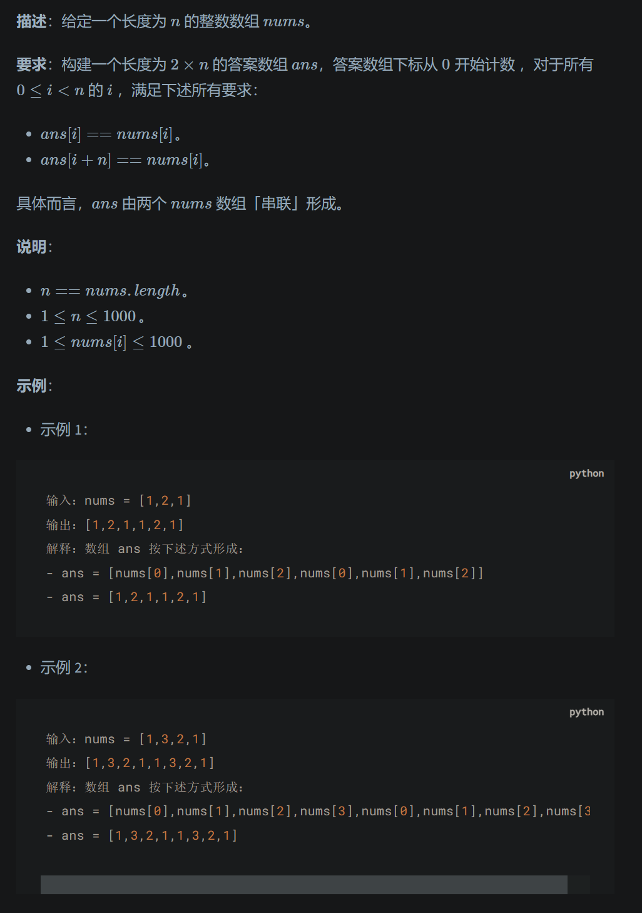
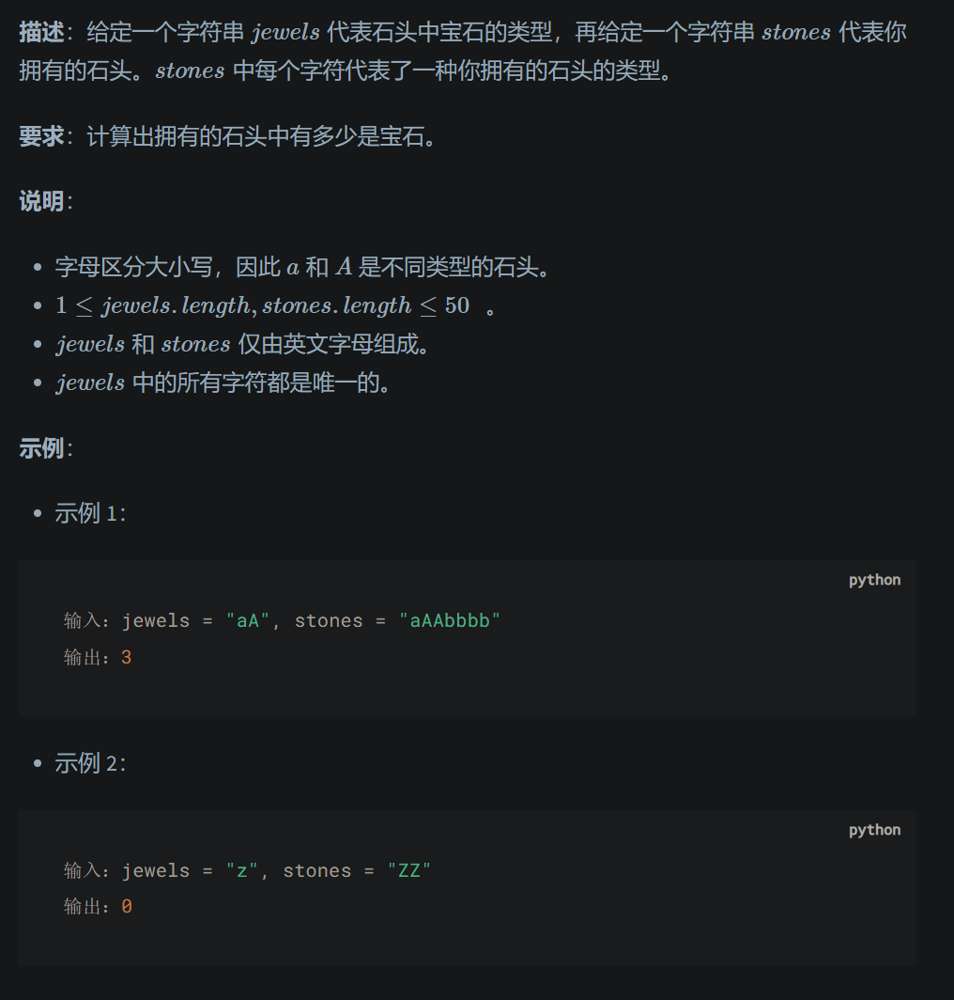
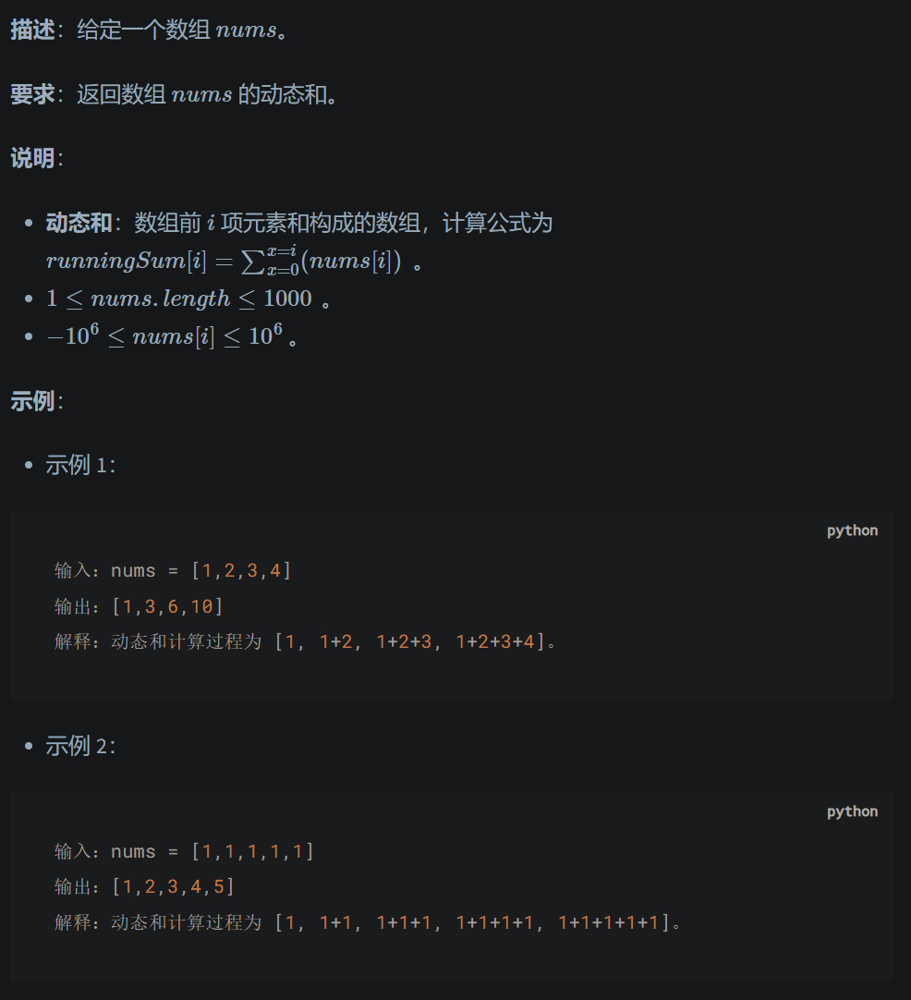
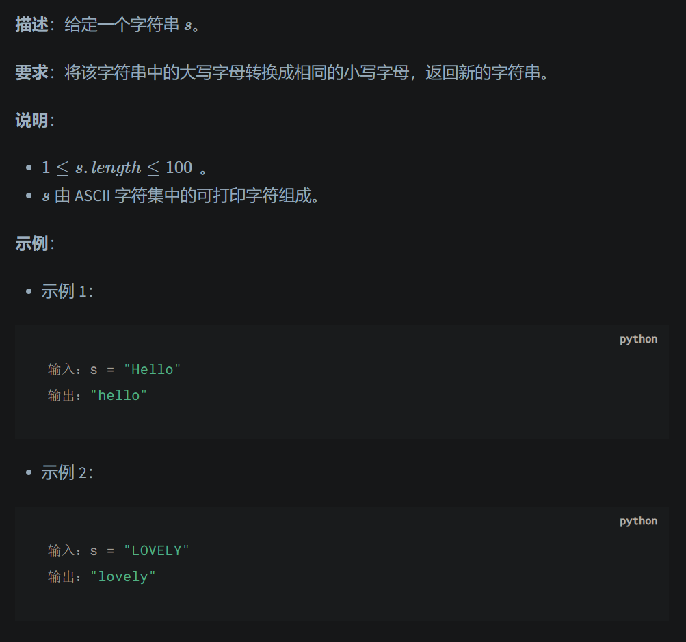
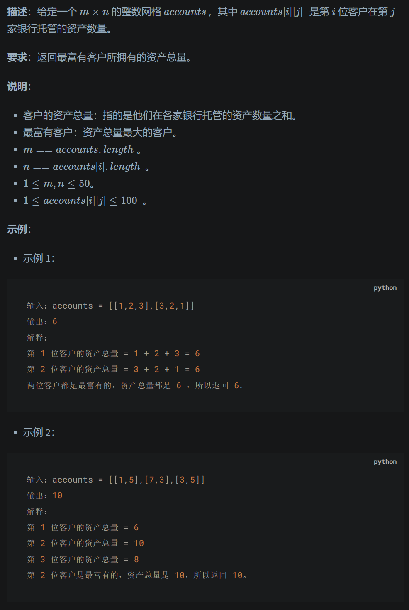

# LeetCode Notes by Datawhale - 16 April 2024

Between Zeron and One, lies the infinite possibility! Hey there, this is Zeron!

程序 = 数据结构 + 算法

## Part one

### 数据结构

组织和存储数据

#### 数据的逻辑结构：

- 集合结构
- 线性结构：数组 链表 - 栈 队列 哈希表
- 树形结构
- 图结构：无向图、有向图、连通图

#### 数据的物理结构：

- 顺序存储结构：读取方便但难操作
- 链式存储结构：操作方便 空间利用率高但空间开销大

### 算法

有穷性、确定性、可行性

目标：时间复杂度和空间复杂度最小，同时保证正确性、可读性、健壮性

## Part two - 算法复杂度

事后统计 - 预先估计

一般呈输入问题规模记作n，复杂度实际就是评估随n增大时间空间的开销增长情况，记作时间复杂度和空间复杂度

### 时间复杂度

**基本操作** ：算法执行中的每一条语句。每一次基本操作都可在常数时间内完成。

**时间复杂度**实际是**渐进时间复杂度**的简称

渐进上界、渐进下界、渐进紧确界…一般只在乎渐进上界


求解时间复杂度一般分为以下几个步骤：

* **找出算法中的基本操作（基本语句）** ：算法中执行次数最多的语句就是基本语句，通常是最内层循环的循环体部分。
* **计算基本语句执行次数的数量级** ：只需要计算基本语句执行次数的数量级，即保证函数中的最高次幂正确即可。像最高次幂的系数和低次幂可以忽略。
* **用大 O 表示法表示时间复杂度** ：将上一步中计算的数量级放入 O 渐进上界符号中。


在求解时间复杂度还要注意一些原则：

* **加法原则** ：总的时间复杂度等于量级最大的基本语句的时间复杂度。
* **乘法原则** ：循环嵌套代码的复杂度等于嵌套内外基本语句的时间复杂度乘积。


常见时间复杂度类型：

- 阶乘：阶乘时间复杂度一般出现在与「全排列」、「旅行商问题暴力解法」相关的算法中。
- 对数：对数时间复杂度一般出现在「二分查找」、「分治」这种一分为二的算法中。
- 线性对数：线性对数一般出现在排序算法中，例如「快速排序」、「归并排序」、「堆排序」等。


常见时间复杂度关系：常数<对数<n<线性对数<平方<三次方<指数<阶乘<n的n倍指数


最佳、最差、平均时间复杂度 一般取最差，排序算法特殊一般取平均

### 空间复杂度

在问题的输入规模为n 的条件下，算法所占用的空间大小，可以记作为S(n)。一般将算法的辅助空间作为衡量空间复杂度的标准。

基本为：「局部变量（算法范围内定义的变量）所占用的存储空间」+「系统为实现递归（如果算法是递归的话）所使用的堆栈空间」

常见空间复杂度：常数<对数<n<平方<指数


## Part three - LeetCode入门

### LeetCode刷题流程

1. 在 LeetCode 题库中选择一道自己想要解决的题目。
2. 查看题目左侧的题目描述，理解题目要求。
3. 思考解决思路，并在右侧代码编辑区域实现对应的方法，并返回题目要求的结果。
4. 如果实在想不出解决思路，可以查看题目相关的题解，努力理解他人的解题思路和代码。
5. 点击「执行代码」按钮测试结果。
   * 如果输出结果与预期结果不符，则回到第 3 步重新思考解决思路，并改写代码。
6. 如果输出结果与预期符合，则点击「提交」按钮。
   * 如果执行结果显示「编译出错」、「解答错误」、「执行出错」、「超出时间限制」、「超出内存限制」等情况，则需要回到第 3 步重新思考解决思路，或者思考特殊数据，并改写代码。
7. 如果执行结果显示「通过」，恭喜你通过了这道题目。

### Leetcode刷题策略

刷题策略主要分为了以下五点：
1、五分钟思考法：如果一道题如果 5分钟之内有思路，就立即动手写代码解题。如果 5分钟之后还没有思路，就直接去看题解。然后根据题解的思路，自己去实现代码。如果发现自己看了题解也无法实现代码，就认真阅读题解的代码，并理解代码的逻辑。
2、重复刷题：遇见不会的题，多刷几遍，不断加深理解。
3、按专题分类刷题：按照不同专题分类刷题，既可以巩固刚学完的算法知识，还可以提高刷题效率。
4、写解题报告：如果能够用简介清晰的语言让别人听懂这道题目的思路，那就说明你真正理解了这道题的解法。
5、坚持刷题：算法刷题没有捷径，只有不断的刷题、总结，再刷题，再总结。

### LeetCode第一题

#### 两数之和



哈希表实现方法：

```python
def twoSum(self, nums: List[int], target: int) -> List[int]:
    numDict = dict()
    for i in range(len(nums)):
        if target-nums[i] in numDict:
            return numDict[target-nums[i]], i
        numDict[nums[i]] = i
    return [0]
```

## Part four - Practise

### [两整数相加](https://leetcode.cn/problems/add-two-integers/)



LC2235 解题思路：直接通过return返回。

```python
class Solution:
    def sum(self, num1: int, num2: int) -> int:
        return num1+num2
```

### [数组串联](https://leetcode.cn/problems/concatenation-of-array/)



LC1929 解题思路：创建一个长度为原来2倍的列表，并按取余方法循环遍历原列表中的元素。

```python
class Solution:
    def getConcatenation(self, nums: List[int]) -> List[int]:
        res=[]
        for i in range(0,len(nums)*2):
            res.append(nums[i%len(nums)])
        return res
```

### [宝石与石头](https://leetcode.cn/problems/jewels-and-stones/)



LC0771 解题思路：通过遍历stones的字符串，查找其是否在jewels里面，若在则返回1；否则返回0。最后求和就可以返回石头中宝石的个数。为了加快查找的效率，将jewels转化为哈希表的集合格式，以便在O(1)时间内查找元素。

```python
class Solution:
    def numJewelsInStones(self, jewels: str, stones: str) -> int:
        jewels=set(jewels)
        return sum(s in jewels for s in stones)
```

### [一维数组的动态和](https://leetcode.cn/problems/running-sum-of-1d-array/)



LC1480 解题思路：利用切片方式，依次取出列表中的1到n个元素进行求和，添加进新列表中

```python
class Solution:
    def runningSum(self, nums: List[int]) -> List[int]:
        res=[]
        for i in range(1,len(nums)+1):
            res.append(sum(nums[0:i]))
        return res
```

### [转换成小写字母](https://leetcode.cn/problems/to-lower-case/)



LC0709 解题思路：直接使用python内置的lower函数，转化为小写

```python
class Solution:
    def toLowerCase(self, s: str) -> str:
        return s.lower()
```

### [最富有客户的资产总量](https://leetcode.cn/problems/richest-customer-wealth/)



LC1672 解题思路：根据题目要求，依次对二维矩阵的每一行进行求和，比较求出最大值即可

```python
class Solution:
    def maximumWealth(self, accounts: List[List[int]]) -> int:
        max_num=0
        for i in range(len(accounts)):
            max_num=max(max_num,sum(accounts[i]))
        return max_num
```
