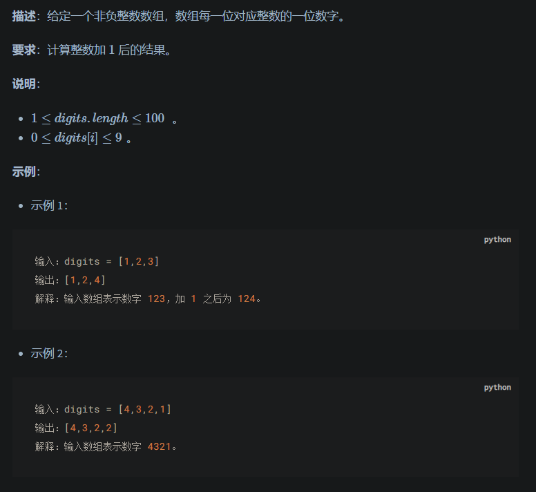
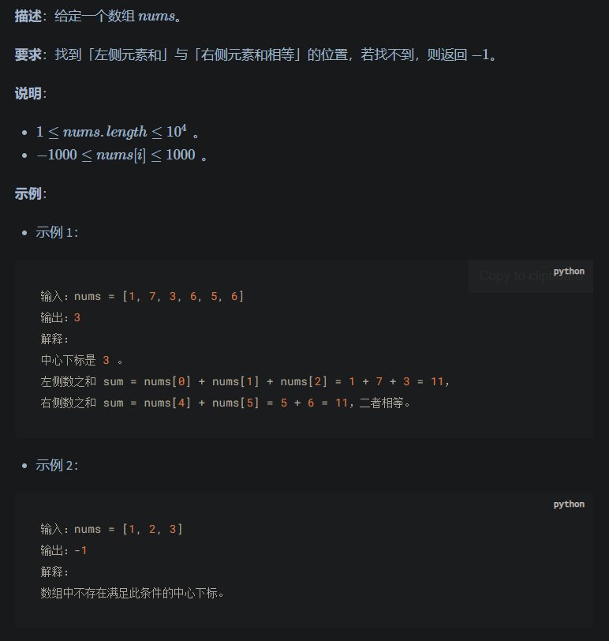
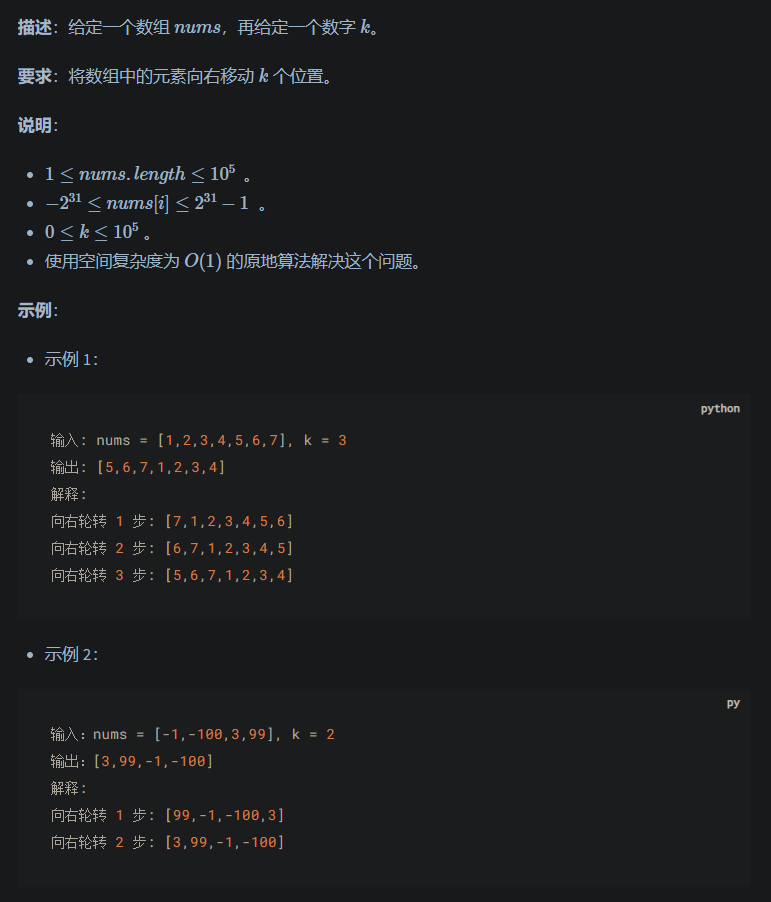
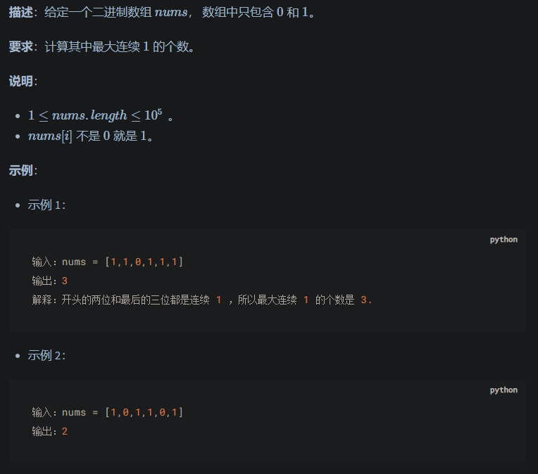
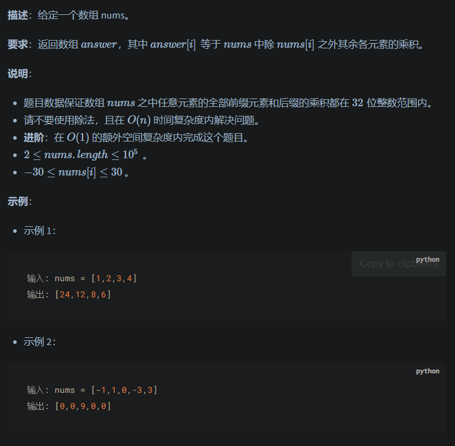
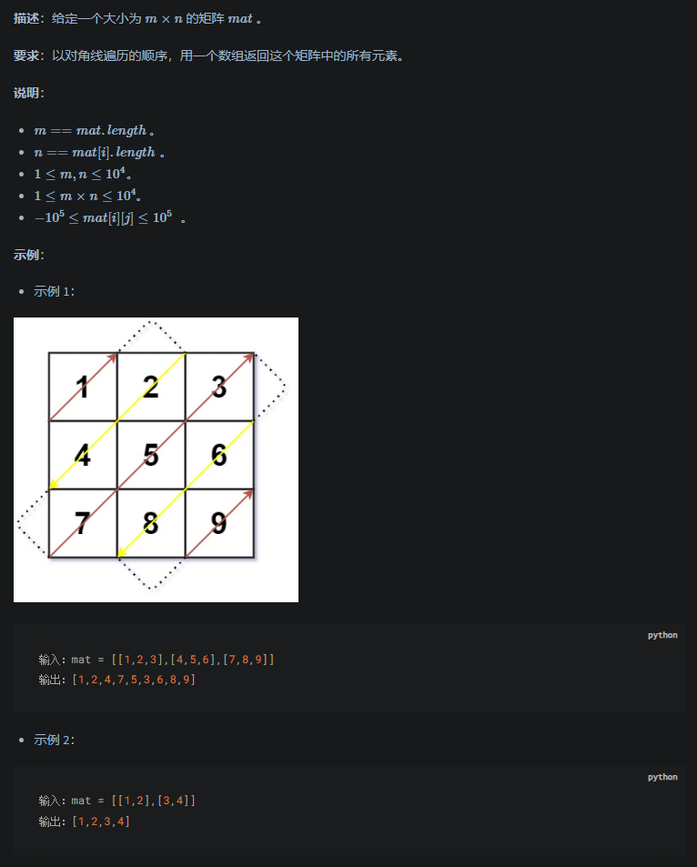
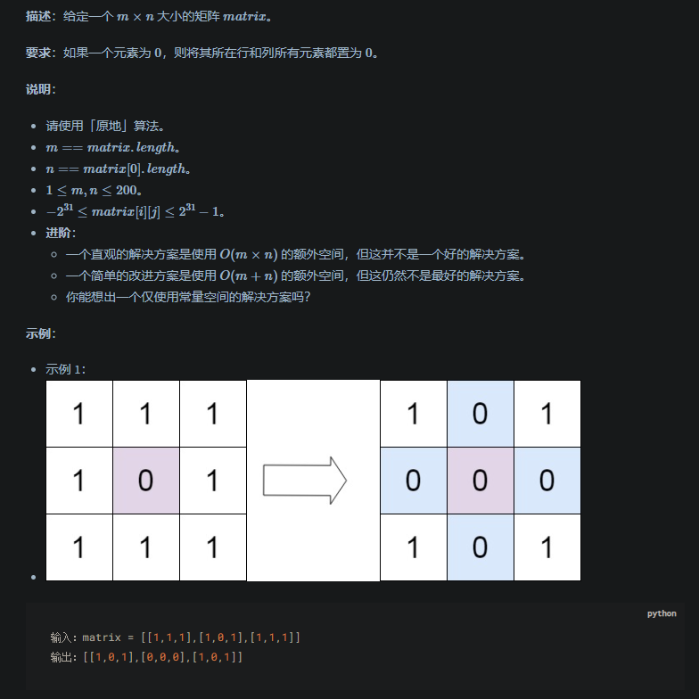
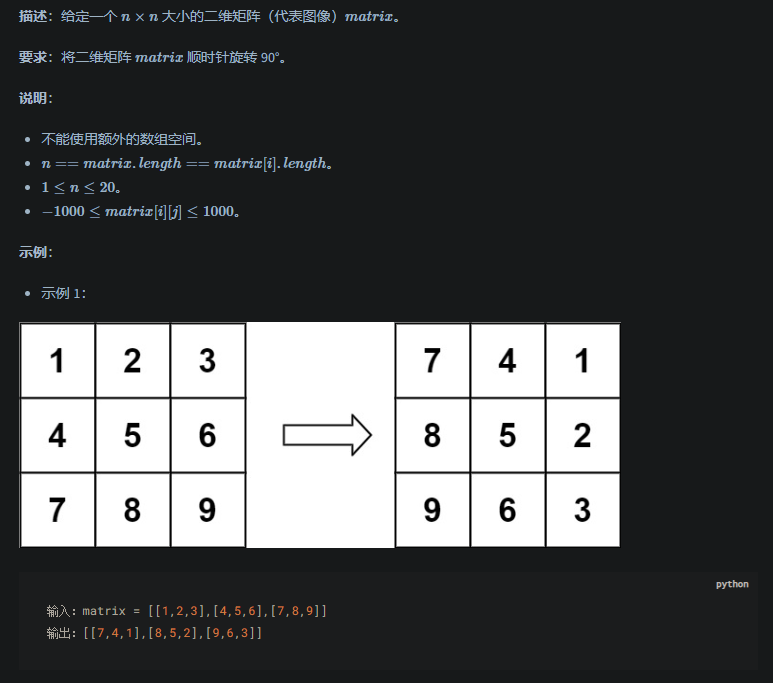
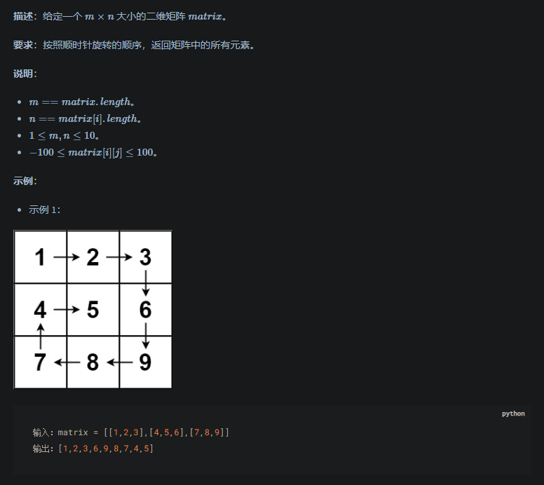
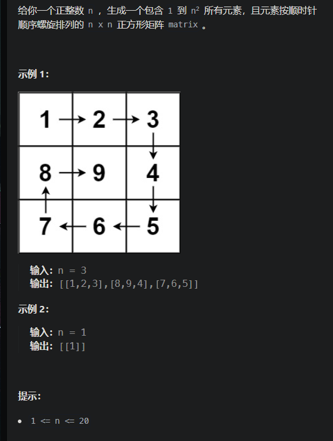

# LeetCode Notes by Datawhale - 18 April 2024

Between Zeron and One, lies the infinite possibility! Hey there, this is Zeron!

这几天学习了数组的定义、随机访问数组元素的方式、多维数组的组成以及不同编程语言中数组的实现。同时学习了访问数组元素、查找数组元素、插入数组元素、改变数组元素以及删除数组元素的方法实现，并学习了其相应的时间复杂度。下面选取了几道 leetcode 中关于数组的题进行练习。

数组是最基础、最简单的数据结构。数组是实现线性表的顺序结构存储的基础。它使用一组连续的内存空间，来存储一组具有相同类型的数据。

数组的最大特点的支持随机访问。访问数组元素、改变数组元素的时间复杂度为 O(1)，在数组尾部插入、删除元素的时间复杂度也是 O(1)，普通情况下插入、删除元素的时间复杂度为 O(n)。

### 一、0066 加一



思路 1：先将列表中的值转化为十进制整数，加一后再通过字符串转整数列表的形式返回。

```python
class Solution:
    def plusOne(self, digits: List[int]) -> List[int]:
        res=0
        for i in range(len(digits)):
             res+=digits[i]10*(len(digits)-1-i)
        res+=1
        return [int(x)for x in str(res)]
```

思路 2：在原列表中进行操作，首先在列表之前拼接一列 0 来确保进位。在循环过程中进行判断，若其中有数为 10，则该索引的数归 0，前一位数+1，最后判断若首位的值为 0，则输出索引为 1 开始的列表，否则全部输出。

```python
digits = [0] + digits
        digits[len(digits) - 1] += 1
        for i in range(len(digits)-1, 0, -1):
            if digits[i] != 10:
                break
            else:
                digits[i] = 0
                digits[i - 1] += 1

        if digits[0] == 0:
            return digits[1:]
        else:
            return digits
```

### 二、0724 寻找数组的中心下标



思路 1：遍历列表，按照题目要求依次判断三种情况即可

```python
class Solution:
    def pivotIndex(self, nums: List[int]) -> int:
        # for i in range(len(nums)):
        #     if i==0 and sum(nums[i+1:])==0:
        #         return i
        #     if i==len(nums)-1 and sum(nums[0:len(nums)-1])==0:
        #         return i
        #     if sum(nums[0:i])==sum(nums[i+1:]):
        #         return i
        # return -1
```

思路 2：进行两次循环，第一次求得列表元素的总和，第二次开始判断相加的和的两倍再加上当前索引元素的值是否等于总和，若等于，则为中心下标。

```python
sum = 0
        for i in range(len(nums)):
            sum += nums[i]
        curr_sum = 0
        for i in range(len(nums)):
            if curr_sum * 2 + nums[i] == sum:
                return i
            curr_sum += nums[i]
        return -1
```

### 三、0189 轮转数组



思路 1：讨巧做法，直接先对轮转次数关于列表长度取余，判断实际右移的变化值。再将倒数 k 个列表元素值与剩余的列表元素值拼接即可。

```python
class Solution:
    def rotate(self, nums: List[int], k: int) -> None:
        """
        Do not return anything, modify nums in-place instead.
        """
        # k%=len(nums)
        # nums[:]=nums[-k:]+nums[:-k]
```

思路 2：翻转数组

```python
class Solution:
    def rotate(self, nums: List[int], k: int) -> None:
        n = len(nums)
        k = k % n
        self.reverse(nums, 0, n-1)
        self.reverse(nums, 0, k-1)
        self.reverse(nums, k, n-1)
    def reverse(self, nums: List[int], left: int, right: int) -> None:
        while left < right :
            tmp = nums[left]
            nums[left] = nums[right]
            nums[right] = tmp
            left += 1
            right -= 1
```

### 四、0485 最大连续 1 的个数



思路 1：双指针法，定义快慢两个指针，遍历数组，当前索引数字为 1 时，则快指针右移一个位置，同时更新最大长度（快慢指针的间隔）；若不为 1 时，则快指针右移一个位置，将慢指针移到快指针位置，进入下一个序列计算。

```python
class Solution:
    def findMaxConsecutiveOnes(self, nums: List[int]) -> int:
        slow=0
        fast=0
        max_len=0
        for i in range(len(nums)):
            if nums[i]==1:
                fast+=1
            else:
                fast+=1
                slow=fast
            max_len=max(max_len,fast-slow)
        return max_len
```

思路 2：一次遍历

```python
class Solution:
    def findMaxConsecutiveOnes(self, nums: List[int]) -> int:
        ans = 0
        cnt = 0
        for num in nums:
            if num == 1:
                cnt += 1
                ans = max(ans, cnt)
            else:
                cnt = 0
        return ans
```

### 五、0238 除自身以外数组的乘积



思路：两次循环，先构造一个与原数组长度相同的全 1 数组，再分别遍历左右元素乘积，注意边界条件处理，在 0 和 len(nums)-1 处分别没有左元素和右元素。

```python
class Solution:
    def productExceptSelf(self, nums: List[int]) -> List[int]:
        res=[1 for _ in range(len(nums))]

        left=1
        for i in range(len(nums)):
            res[i]*=left
            left*=nums[i]

        right=1
        for j in range(len(nums)-1,-1,-1):
            res[j]*=right
            right*=nums[j]
        return res

```

### 六、0498 对角线遍历



思路：找规律+考虑边界问题

```python
class Solution:
    def findDiagonalOrder(self, mat: List[List[int]]) -> List[int]:
        rows = len(mat)
        cols = len(mat[0])
        count = rows * cols
        x, y = 0, 0
        ans = []

        for i in range(count):
            ans.append(mat[x][y])

            if (x + y) % 2 == 0:
                # 最后一列
                if y == cols - 1:
                    x += 1
                # 第一行
                elif x == 0:
                    y += 1
                # 右上方向
                else:
                    x -= 1
                    y += 1
            else:
                # 最后一行
                if x == rows - 1:
                    y += 1
                # 第一列
                elif y == 0:
                    x += 1
                # 左下方向
                else:
                    x += 1
                    y -= 1
        return ans

```

### 七、0073 矩阵置零



思路：设置两个标记值，分别预先标记第一行和第一列，这样做的目的是使其他元素在修改时可以不覆盖值，从而影响后续操作。过程如下：首先遍历第一行和第一列，若有零元素，将标记值设为 True,这样在最后遍历时，会将第一行或第一列元素全置为 0.再遍历剩余元素，若为 0，则将第一行或者第一列对应的元素置为 0，设置完成后，再进行一次遍历，将行列剩余元素置为 0

```python
m = len(matrix)
        n = len(matrix[0])
        flag_col0 = False
        flag_row0 = False
        for i in range(m):
            if matrix[i][0] == 0:
                flag_col0 = True
                break

        for j in range(n):
            if matrix[0][j] == 0:
                flag_row0 = True
                break

        for i in range(1, m):
            for j in range(1, n):
                if matrix[i][j] == 0:
                    matrix[i][0] = matrix[0][j] = 0

        for i in range(1, m):
            for j in range(1, n):
                if matrix[i][0] == 0 or matrix[0][j] == 0:
                    matrix[i][j] = 0

        if flag_col0:
            for i in range(m):
                matrix[i][0] = 0

        if flag_row0:
            for j in range(n):
                matrix[0][j] = 0

```

### 八、0048 旋转图像



思路：原地旋转

需要注意的是一共旋转的次数，当矩阵元素个数为偶数时，全部旋转，当为奇数时，正中心元素不旋转。

```python
class Solution:
    def rotate(self, matrix: List[List[int]]) -> None:
        n = len(matrix)

        for i in range(n // 2):
            for j in range((n + 1) // 2):
                matrix[i][j], matrix[n - j - 1][i], matrix[n - i - 1][n - j - 1], matrix[j][n - i - 1] = matrix[n - j - 1][i], matrix[n - i - 1][n - j - 1], matrix[j][n - i - 1], matrix[i][j]

```

### 九、0054 螺旋矩阵



思路：考虑设置四条边界（上、下、左、右），按照逆时针顺序从边界上依次访问元素，当接近边界时，更新边界，缩小范围，直到边界碰撞，结束访问。

```python
class Solution:
    def spiralOrder(self, matrix: List[List[int]]) -> List[int]:
        if not matrix: return []
        l, r, t, b, res = 0, len(matrix[0]) - 1, 0, len(matrix) - 1, []
        while True:
            for i in range(l, r + 1): res.append(matrix[t][i]) # left to right
            t += 1
            if t > b: break
            for i in range(t, b + 1): res.append(matrix[i][r]) # top to bottom
            r -= 1
            if l > r: break
            for i in range(r, l - 1, -1): res.append(matrix[b][i]) # right to left
            b -= 1
            if t > b: break
            for i in range(b, t - 1, -1): res.append(matrix[i][l]) # bottom to top
            l += 1
            if l > r: break
        return res
```

### 十、0059 螺旋矩阵 II



思路：和螺旋矩阵的思路基本类似，不同的是要手动创建一个空矩阵，将 index 从 1 开始依次填入。

```python
class Solution:
    def generateMatrix(self, n: int) -> List[List[int]]:
        l=0
        r=n-1
        t=0
        b=n-1
        index=1
        matrix=[[0 for _ in range(n)]for _ in range(n)]
        while True:
            for i in range(l,r+1):
                matrix[t][i]=index
                index+=1
            t+=1
            if t>b:break

            for i in range(t,b+1):
                matrix[i][r]=index
                index+=1
            r-=1
            if l>r:break

            for i in range(r,l-1,-1):
                matrix[b][i]=index
                index+=1
            b-=1
            if t>b:break

            for i in range(b,t-1,-1):
                matrix[i][l]=index
                index+=1
            l+=1
            if l>r:break

        return matrix
```
