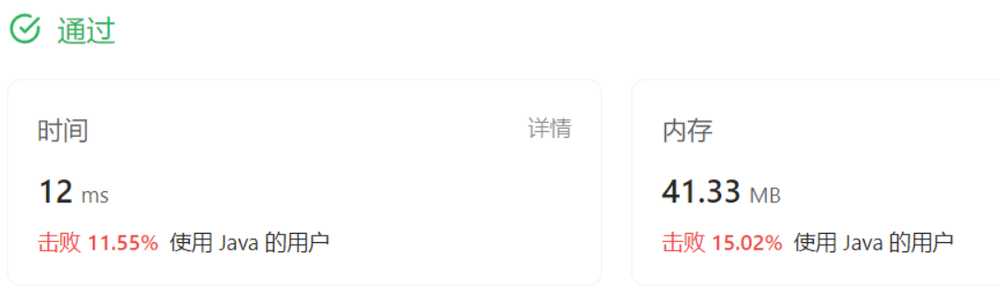
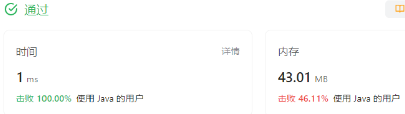
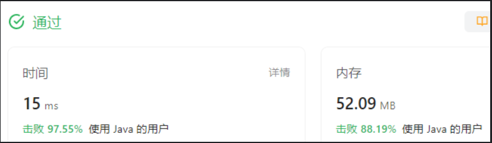
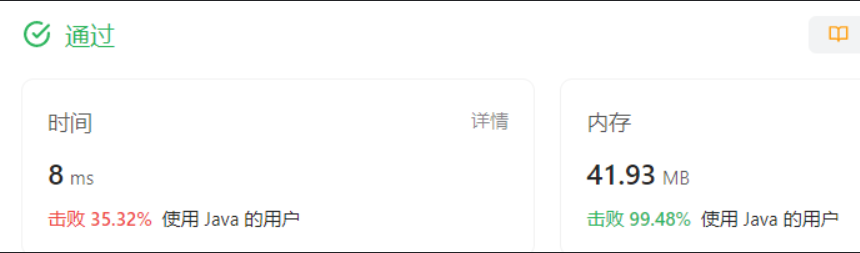
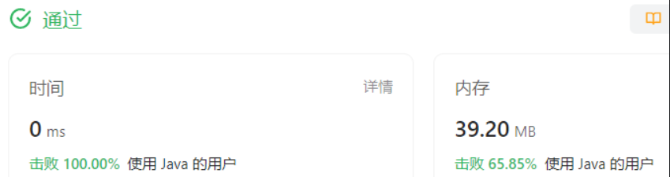

### 冒泡排序

一种基于交换的排序，
**最佳情况**：只走一趟，未出现交换元素。O（n）
**一般情况**：O（n^2）
**稳定性**：稳定的，相等的元素不会被交换\*\*。\*\*

### 选择排序

每次从无序部分里选出最小一个，~~放在 idx 处。~~ 与 idx 处的元素交换位置（这可能会产生元素相对位置的变化，指的是原本 idx 处的元素与他相等的元素）。
**最佳最坏**：无论哪种情况，遍历的次数都是一样的。所以 O（n^2）
**稳定性**：不稳定的。

### 插入排序

将无序部分中的第一个元素，插入到前面有序部分中的正确位置上。这里的插入跟数组的插入数字一致，涉及到移动元素。
\*\*最好情况：\*\*每次都不需要插入，意味着不用移动元素 O(n)
**最坏情况**：逆序，O（n^2）
**稳定性**：稳定。相等元素的相对位置不会改变，并且这不是一个基于交换的算法（隔位直接交换两个元素位置），所以一定是稳定的。

### 练习题目（第 05 天）

#### 1.剑指 Offer 45. 把数组排成最小的数

#### 1.1 题目大意

**描述：** 给定一个非负整数数组 。

要求：将数组中的数字拼接起来排成一个数，打印能拼接出的所有数字中的最小的一个。

#### M：

按从小到大排序数组，小的意思是最高位小的才叫小。
如果最高位相同就比较次高位，依此类推。如果位数不够，直接填补~~前一位的结果~~。比如 3 和 34，由于３只有一位，最高位相同，比较第二位的时候，直接用３，即，３看成３３。理由就是，根据我们的拼接规则 ，接在３之后的数字最高位肯定是不小于３的。
填补前一位，填补最高位都是不完善方案，都会出现特殊情况。
比如\[82,827] \[12,121],最简单的做法还是老老实实拼出来比数字 大小吧。

#### C：

根据上面的思路做了一个比较函数，但是效果不行，在求位数长度时出现问题，比如 0 应该算做长度为 1，在使用 Math API 时这不好处理。

```java
 public static boolean compare(int a, int b){
        // a < b 返回true， 否则返回false

        // 两个数字比大小，先比较最高位，
        int a_l = (int) Math.log10(a)+1; // a的长度
        int b_l = (int) Math.log10(b)+1; // b的长度
        int a_ = a / (int)Math.pow(10, a_l - 1); // a的最高位
        int b_ = b / (int)Math.pow(10, b_l - 1); // b的最高位
        int top_a = a_;
        int top_b = b_;
        while(a_l > 0 || b_l > 0){
            if(a_ < b_){ // 最高位能直接判断出大小关系
                return true;
            }
            if(b_ < a_){// 最高位能直接判断出大小关系
                return false;
            }
            a_l--;b_l--;
            if(a_l <= 0){
                a_ = top_a;
            }else{
                a_ = (a / (int)Math.pow(10, a_l - 1)) % 10;
            }
            if(b_l <= 0){
                b_ top_b;
            }else{
                b_ = (b / (int)Math.pow(10, b_l - 1)) % 10;
            }
        }
        return false;  // a并没有比b小
    }

```

但了下题解，学习到一种更好的比较方法，ab 拼成的数字那如果小于 ba 拼成的数字说明 a 更小，更适合在前。~~如果是字符串转换成 int 感觉效率会差。还是得算位数，现求和。~~
其实只需要 ab ba 字符串比较大小即可，

```java
class Solution {
    public String minNumber(int[] nums) {
        // 使用插入排序，每次选出最小的一个放在idx处。
        for(int i = 0; i < nums.length; i++){
            int min = i;
            for(int j = i + 1; j < nums.length; j++){
                if(compare(nums[j], nums[min])){ // j更小的话
                    min = j;
                }
            }
            // 交换位置
            int temp = nums[i];
            nums[i] = nums[min];
            nums[min] = temp;
        }
        StringBuffer res = new StringBuffer();
        for(int i = 0; i < nums.length; i++){
            res.append(nums[i]);
        }
        return res.toString();


    }
    public boolean compare(int a, int b){
        // 返回  a < b 的结果
        // 直接使用字符串的比较方式
        String as = String.valueOf(a);
        String bs = String.valueOf(b);
        String ab = as + bs;
        String ba = bs + as;

        return ab.compareTo(ba) < 0;  // 直接使用字符串的比较方式

    }

}
```

虽然通过了，但是执行效率不好


学习一下别人的优点
优化的方向是，直接将原数组转成字符串数组，直接使用 API 对数组排序，排序的 compare 方法就使用上面写过的，但是此时不需要再数值转换。可以使用 lambda 表达式。

```java
class Solution {
    public String minNumber(int[] nums) {
        // 使用插入排序，每次选出最小的一个放在idx处。
        String[] strs = new String[nums.length];
        for(int i = 0; i < nums.length; i++){
            strs[i] = String.valueOf(nums[i]);
        }
        Arrays.sort(strs, (a, b) -> (a + b).compareTo(b + a));
        StringBuilder res = new StringBuilder();
        for(String s : strs){
            res.append(s);
        }
        return res.toString();
    }
}
```


效率提升了

#### 2.0283. 移动零

#### 2.1 题目大意

**描述：** 给定一个数组 。

**要求：** 将所有移动到末尾，并保持原有的非数字的相对顺序。

#### M：

其实这就是一道去重的问题，理解成去重 0。使用去重的做法，双指针，一快一慢，快指针访问，慢指针指向填写的位置遇到 0 快指针就跳过。最后把慢指针把余下的空位都填 0 即可。

#### C：

```java
class Solution {
    public void moveZeroes(int[] nums) {
        int low = 0; // 慢指针:存储的位置
        int high = 0; //快指针：访问的位置
        for(; high < nums.length; high++){
            if(nums[high] != 0){
                nums[low] = nums[high];
                low++;
            }
        }
        for(;low <nums.length; low++){
            //剩余部分填充0
            nums[low] = 0;
        }
    }
}
```



#### 3.0912. 排序数组

#### 3.1 题目大意

**描述：** 给定一个整数数组 。

**要求：** 将该数组升序排列。

#### M：

题目中的数组长度最高有 5W，最好使用快排一类的排序算法。这里直接使用 API 了。

#### C：

```java
class Solution {
    public int[] sortArray(int[] nums) {
        Arrays.sort(nums);
        return nums;
    }
}
```



### 归并排序

以前学习归并一直没记清的部分：

- 归并前有一个分解的过程，数组分成左右两个部分，**直到长度为 1 的有序数组**
- 第二部分才是：将两个有序数组合并成一个大的有序数组。

至于编码部分，这是个递归的算法，直接看着步骤描述，其实很想出这种递归的代码该怎么写。哪些部分在递归。因为主体部分是

```java
public int[] mergeSort(int[] nums){
    if(nums.length == 1) // 长度为1就是有序
        return nums;
    int mid = nums.length / 2;
    left = mergeSort(~~Arrays.copyOfRage(nums, 0, mid)~~);  // 递归排序 左部分
    right = mergeSort(~~Arrays.copyOfRange(nums, mid, nums.length)~~; // 递归排序 右部分
    return merge(left, right); // 将两个有序的数组合并成一个大的有序数组。

    // 实际上如果这样频繁复制数组是很容易暴栈的。
}
```

理论学习的时候，分解和合并是分开讲的，都具有递归性。而写成代码的时候，我感觉他们杂糅在一起了。你要说代码和说明不符合吗？其实每个关键点都有对应，而且代码简洁漂亮，但是我就是很难设计出这样的代码结构。看来还是内力不够。

时间复杂度：归并的趟数是 O（log），但是每趟所有的元素都会被遍历一次。所以最终是 O（nlog）
空间复杂度：每趟都要一个长度为 n 的数组放合并之后的结果，上一趟的就不用留了。所以空间复杂 O（n）
稳定性：其实稳定性完全可以看有没有涉及跨元素的交换位置，这个排序算法根本都没有在原数组上做位置交换的操作（毕竟空间复杂度为 O（n））， 无脑认定是稳定的就行了。实际上相等元素的分解、归并的过程中位置也确实没有发生改变。

### 希尔排序

插入排序的变种 gap 不断缩小，最后为 1（即最后一趟相当于一次标准的插入排序），由于最后基本有序，所以最后一趟基本上不涉及元素位置的移动。

涉及到分组和插入排序相结合，代码还真是不好写。
几个关键点：组数 = 移动的步长 = gap
希尔里的组和平常分组有点不同，位置上相邻的元素属于不同的组。
平常我们分 2 组是 aaaaabbbbb
在希尔里的 2 组是 ababababab

```java
public class ShellSort {
    public static void main(String[] args){
        int[] nums = {7, 2, 6, 8, 0, 4, 1, 5, 9, 3};
        System.out.println(Arrays.toString(shellSort(nums)));
    }
    public static int[] shellSort(int[] nums){
        // 1. 每组只有2个元素，组数较多。 组数 = 步长 = gap
        int gap = nums.length / 2;
        // 2.
        while(gap > 0){
            // 做插入排序，每组的第一个元素都是有序的。从每组的第二个元素开始
            for(int i = gap; i < nums.length; i++){  // 包括了对每组做一次插入排序
                // 2.1 插入排序记录当前位置
                int temp = nums[i];
                // 2.2 找到当前元素该插入的位置——在它前面的，比它大的元素需要后移。
                int j = i;
                while(j >= gap && nums[j - gap] > temp){
                    nums[j] = nums[j - gap];
                    j -= gap;
                }
                nums[j] = temp;
            }
            // 缩小间隔
            gap /= 2;
        }
        return nums;
    }
}
```

看着写还是有纰漏，看来以后要是时不时默写一下希尔代码。

### 练习题目（第 06 天）

#### 1.0506. 相对名次

#### 1.1 题目大意

**描述：** 给定一个长度为 的数组 。其中表示第名运动员在比赛中的成绩。所有成绩互不相同。

**要求：** 找出他们的相对名次，并授予前三名对应的奖牌。前三名运动员将会被分别授予「金牌（"Gold Medal"）」，「银牌（"Silver Medal"）」和「铜牌（"Bronze Medal"）」。

#### M：

问题的关键点在于，在排序之前要保留下原本的位置。你可以使用字典映射，下面的解法是类似于封装，将原本的分数和位置封装在一个长度为二的数组里，排序的时候是对 对象进行排序。Arrays.sort 自定义排序方法。

#### C：

```java
class Solution {
    public String[] findRelativeRanks(int[] score) {
        int[][] copy = new int[score.length][2];
        String[] strs = {"Gold Medal", "Silver Medal", "Bronze Medal"};
        String[] res = new String[score.length];
        for(int i = 0; i < score.length; i++){
            copy[i][0] = score[i];   // 第一个位置放得分
            copy[i][1] = i;         // 第二个位置放原来的索引
        }
        Arrays.sort(copy, (a, b) -> b[0] - a[0]);
        for(int i = 0; i < copy.length; i++){
            if(i < 3){
                res[copy[i][1]] = strs[i];
            }else {
                res[copy[i][1]] = String.valueOf(i + 1);
            }
        }
        return res;
    }
}
```



#### 2.0088. 合并两个有序数组

#### 2.1 题目大意

**描述：** 给定两个有序数组 、。

**要求：** 将 合并到 中，使 成为一个有序数组。

#### M：

本题的特殊之处在于，1 号数组是最终要输出的，但是它前 m 个位置先占住了，如果是原本的归并合并方式不太适用。需要变换一下思路不再从小到大归并，而是从大到小归并。指针指向数组最后一个元素，从后往前归并。

#### C：

最后处理剩余段的时候，如果是 nums2 没清空，那就按照原本的做法，将剩余的放入 nums1 余下的空间。否则就不用再处理了。因为剩下部分原本的位于 nums1

```java
class Solution {
    public void merge(int[] nums1, int m, int[] nums2, int n) {
        int i1 = m - 1;
        int i2 = n - 1;
        int i = m + n - 1;
        while(i1 >=0  && i2 >= 0){
            if(nums1[i1] > nums2[i2]){ // 从后往前归并，每次找最大的数。
                nums1[i--] = nums1[i1--];
            }else{
                nums1[i--] = nums2[i2--];
            }
        }
        if(i2 >= 0){
            while (i2 >= 0){
                nums1[i--] = nums2[i2--];
            }
        }else {
            // 本来就是位于nums1，不用管了
        }
    }
}
```



#### 3.剑指 Offer 51. 数组中的逆序对

#### 3.1 题目大意

**描述：** 给定一个数组 。

**要求：** 计算出数组中的逆序对的总数。

#### M：

逆序对这题是经典的归并排序。

两个有序数组 A,B 在合并的进程中，假设两个数组的相对位置为 A 在前 B 在后，即 arr = AB.

计算逆序对的方法中，主视角是当前元素，看当前元素能和它之前的哪些元素形成逆序对。

当 merge AB 成有序的过程中，若 B【j】中的元素小于 A【i】，那么 B【j】可以和 A【i\~end】这些元素都能组成逆序对，因为 A 是有序的，这些元素都比 B【j】要大。

最后 AB 归并完形成一个大段，记成 C，此时 C 中不存在逆序对，接下来要算逆序对的是位于 C 右侧的 D，重复刚才上面的操作。
整个过程的实现，也就是在归并排序的 merge 阶段添加一下计算逆序对的代码而已。整体的代码框架和归并是一样的。

#### C：

```java
class Solution {
    private int count = 0;

    public int[] mergeSort(int[] nums){
        if(nums.length == 1){
            return nums;
        }

        int mid = nums.length / 2;
        int[] left = mergeSort(Arrays.copyOfRange(nums, 0, mid));
        int[] right = mergeSort(Arrays.copyOfRange(nums, mid, nums.length));
        return merge(left, right);
    }

```

~~这个代码在递归的部分使用 `Arrays.copyOfRange`复制数组，会导致栈溢出的问题。下面将其它修改成用下标的形式传参，不再复制数组。~~

==纠正一下，其实出错的样例是====`[]`====空的数组，在递归的结束条件那里，应该写成 ====`<= 1`==== 而不是====` == 1`==
这是我又写了一版没用 `Arrays`API 的代码后，还是出同样错误，仔细阅读了一下才发现的。

```java
class Solution {
    private int count = 0;
    public int reversePairs(int[] nums) {
        mergeSort(nums, 0, nums.length);
        return count;
    }
    public void mergeSort(int[] nums, int start, int end){
        if(end - start <= 1){ // 如果写成 ==1，空数组的样例就会再现无限递归
            return ;
        }
        int mid = start + (end - start) / 2;
        mergeSort(nums, start, mid);
        mergeSort(nums, mid, end);
        merge(nums, start, mid, end);
    }
    public  void merge(int[] nums, int start, int mid, int end){
        int[] res = new int[end - start];
        int left = start;
        int right = mid;
        int i = 0;
        while(left < mid && right < end){
            if(nums[right] < nums[left]){
                count += mid - left;
                res[i++] = nums[right++];
            }else{
                res[i++] = nums[left++];
            }
        }
        if(right < end){
            while(i < res.length){
                res[i++] = nums[right++];
            }
        }else {
            while(i < res.length){
                res[i++] = nums[left++];
            }
        }
        for(i = 0; i < res.length && start < end; i++, start++){
            nums[start] = res[i];
        }
    }
}
```


### 快速排序

几句话总结：每次将一个数放到它应该放的位置。做法，双指针（low，high），一个从前往后，一个从后往前。将小于 pivot 放在数组前部，将大于 pivot 的放在数组后部。两指针相遇的地方就是 pivot 该放的地方。

思索：如果是直接让我实现快速排序， 我

### 堆排序

JAVA 中的优先队列 PriorityQueue 底层默认使用堆排序实现，

**所以我们使用 PriorityQueue 就能实现堆的功能。**
