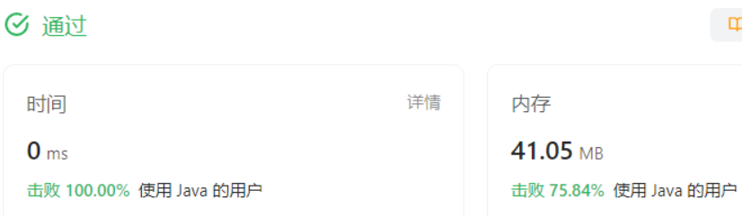
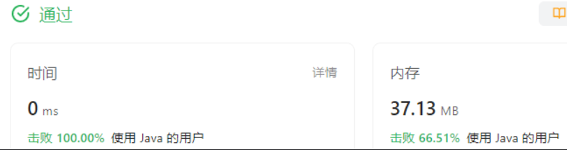
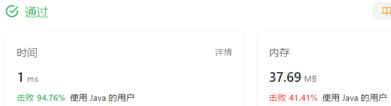
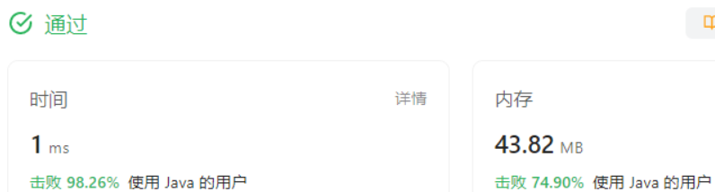
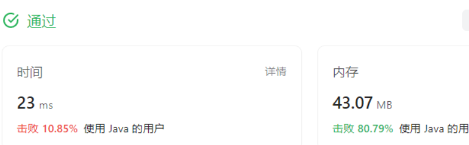
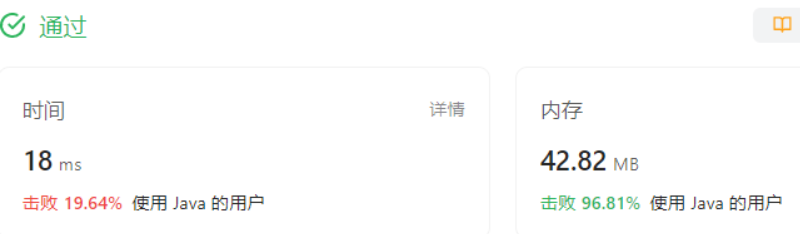
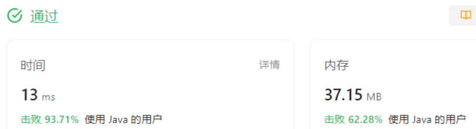
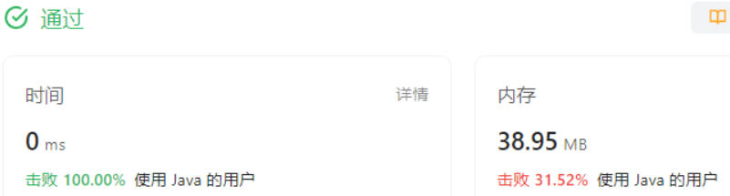
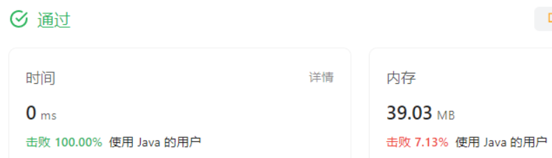
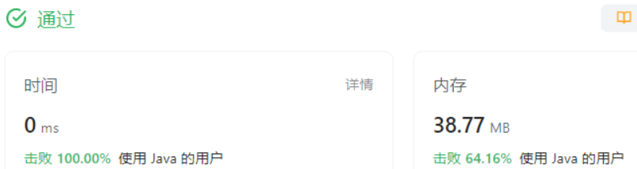

### 二分查找

折半查找。要求数组有有序。
左闭右开，只要保证每次递归时，范围都保持一致就可以。因为mid是不是正中间，不重要，二分，三分，还是五分查找，从时间复杂度上讲都是一样的。

### 练习题目（第09天）

#### 1.0704. 二分查找

#### 1.1 题目大意

**描述：** 给定一个升序的数组 ，和一个目标值
。

**要求：** 返回 在数组中的位置，如果找不到，则返回 -1。

**说明：** 你可以假设  中的所有元素是不重复的。

#### M：

习惯对于一个数组范围，用左闭右开，只要在编程的过程中，全程保持一致（递归参数传入时）。就没什么问题.
闭就是能取到，开就是不能取到。很好理解。

#### C：

```java
class Solution {
    public int search(int[] nums, int target) {
        // 我采用左闭右开的方式
        int start = 0;
        int end = nums.length;
        return half(nums, start, end, target);
    }
    public int half(int[] nums, int start, int end, int target){
        if(start >= end){return -1;} //长度非法，直接返回找不到
        int mid = start + (end - start) / 2;
        if(nums[mid] == target){
            return mid;
        }
        if(nums[mid] > target){
            return half(nums, start, mid, target);  // 左闭右开，保持一致即可
        }else{
            return half(nums, mid + 1, end, target);
        }
      
    }
}
```


#### 2.0035. 搜索插入位置

#### 2.1 题目大意

**描述：** 给定一个排好序的数组 ，以及一个目标值 。

**要求：** 在数组中找到目标值，并返回下标。如果找不到，则返回目标值按顺序插入数组的位置。

#### M：

这题的代码跟上一题一模一样，差别在输出的时候。上一题找不到是输出-1。而这里

找不到的位置，就是他本该位于的位置，插入在这里就好了。

#### C：

```java
class Solution {
   public int searchInsert(int[] nums, int target) {
        int start = 0;
        int end = nums.length;
        return half(nums, start, end, target);
    }


    public int half(int[] nums, int start, int end, int target){
        if(start >= end){return start;} //长度非法，直接返回找不到
        int mid = start + (end - start) / 2;
        if(nums[mid] == target){
            return mid;
        }
        if(nums[mid] > target){
            return half(nums, start, mid, target);  // 左闭右开，保持一致即可
        }else{
            return half(nums, mid + 1, end, target);
        }

    }
}
```



#### 3.0374. 猜数字大小

#### 3.1 题目大意

**描述：** 猜数字游戏。给定一个整数 和一个接口 def guess(num: int) -> int:，题目会从 中随机选取一个数 。我们只能通过调用接口来判断自己猜测的数是否正确。

**要求：** 要求返回题目选取的数字 。

#### M：

数据范围是 1~n，显然这是折半查找的一个应用。
将判断条件里的语句换成题目提供的接口就好。

#### C：

如果使用之前的模板，左闭右开，end = n + 1。是可能会爆int滴。所以这题目使用左闭右闭。

```java
public class Solution extends GuessGame {
    public int guessNumber(int n) {
        int start = 0;
        int end = n; //等于2^31-1 左闭右开会超int
        return half(start, end);
    }

    public int half(int start, int end){ //改成左闭右闭
        if(start >= end){return start;} //长度非法，直接返回找不到
        int mid =  start + (end - start) / 2;
        if(guess(mid) == 0){
            return  mid;
        }
        if(guess(mid) == -1){
            return half(start, mid - 1);  // 左闭右闭，保持一致即可
        }else{
            return half(mid + 1, end);
        }

    }
}
```



### 练习题目（第10天）

#### 1.0069. x 的平方根

#### 1.1 题目大意

**要求：** 实现 int sqrt(int x) 函数。计算并返回  的平方根（只保留整数部分），其中  是非负整数。
说明：

#### M:

依旧使用折半查找的方式，区别在于，判断条件部分修改一下，原本是nums[mid] ==target,现在变成mid * mid == target
需要额外的判断逻辑是：如果大了，那肯定找到的根不对，但是如果小了那就不一定。因为8的根是2.+，题目要求输出整数部分。正好是2。2的平方是4确实小于8。真正判断小的依据是2，和3（mid + 1）平方都小那才是真的小了。

#### C:

平方是可能 会爆数据类型int的。

```java
class Solution {
    public int mySqrt(int x) {
        int start = 0;
        int end = x / 2 + 1;  //从一半的地方开始找
        return half(start, end, x);
    }
    public int half(int start, int end, int target){ //左闭右开
        if(start >= end){return start;} //长度非法，直接返回找不到
        int mid =  start + (end - start) / 2;
        long squa = (long)mid * (long)mid;   // 改成long才不会爆
        long squa_ = (long)(mid+1) * (mid+1);
        if(squa == target){
            return  mid;
        }
        if(squa > target){
            return half(start, mid, target);  // 左闭右开，保持一致即可
        }else if(squa < target && squa_ > target){  // 2^2 < 8 && 3^2 > 8,所以2是正确的。
            return mid;
        }else{
            return half(mid + 1, end, target);
        }

    }
}
```



#### 2.0167. 两数之和 II - 输入有序数组

#### 2.1 题目大意

**描述：** 给定一个下标从  开始计数、升序排列的整数数组： 和一个目标值 。

**要求：** 从数组中找出满足相加之和等于  的两个数，并返回两个数在数组中下的标值。

#### M：

有序数组可以将targer看成  和 = 小 + 大。双指针，一个放头一个放尾，和大了就让大指针左移变小，和小了就让小指针右移变大。直接找到为止。
这个思路一定可以找到。而且只遍历一次。

#### C：

```java
class Solution {
    public int[] twoSum(int[] numbers, int target) {
        int low = 0;
        int high = numbers.length - 1;
        int[] res = new int[2];
        while(low < high){ // 两个数不相等
            int sum = numbers[low] + numbers[high];
            if(sum == target){
                res[0] = low + 1;
                res[1] = high + 1;  //下标从1开始
                return res;
            }
            else if(sum < target){
                low++;
            }else{
                high--;
            }
        }
        return res;
    }
}
```



#### 3.1011. 在 D 天内送达包裹的能力

#### 3.1 题目大意

描述：传送带上的包裹必须在 天内从一个港口运送到另一个港口。给定所有包裹的重量数组
，货物必须按照给定的顺序装运。且每天船上装载的重量不会超过船的最大运载重量。

要求：求能在
 天内将所有包裹送达的船的最低运载量。

#### M：

如果是二分查找的话，要先找一个上限，一个下限。比较直观的最低下限就是，每趟都能正好装载相同的重量，这样的船是最小的 = 总重量 / 天数， 前提是不能小于最大单件货物。
上限找一个相对低一点的。比如将货物数量均分成 days份。看看哪份的重量最大，船的上限就定成这个。

最低运载量应该是可以满足任务，但是再小一就不行了的整数。否则就还有减小的空间。
如果 当前运载量不能满足天数内，那肯定得加

#### C：

```java
class Solution {
    public int shipWithinDays(int[] weights, int days) {
        int max_stuff = 1; // 最大的货，船至少要能装下最大的货
        int max_group = weights.length / days; //单组最大
        int sum = 0; // 货物总重量
        int group_temp = 0;
        // 初始化信息
        for(int i = 0; i < weights.length; i++){
            if(weights[i] > max_stuff){
                max_stuff = weights[i];
            }
            group_temp += weights[i];
            sum += weights[i];
            if(i % days == 0){
                if(group_temp > max_group){
                    max_group = group_temp;
                    group_temp = 0;
                }
            }
        }

        int min_group = Math.min(sum / days, max_stuff); // 船量理论最小
        max_group = Math.max(max_group, group_temp); //船的上限
        return half(weights, min_group, sum, days); // 将船的上界直接设置成sum

    }
    public int half(int[] weights, int start, int end, int days) {
        while (start <= end) {
            int mid = start + (end - start) / 2;
            if (countDays(weights, mid, days) && !countDays(weights, mid - 1, days)) {
                // 当前，小一点就不行
                return mid;
            } else if (!countDays(weights, mid, days)) {
                start = mid + 1; // 调整左边界
            } else {
                end = mid - 1; // 调整右边界
            }
        }
        return start; // 如果没有找到合适的容量，可以根据需要返回一个值
    }

    public boolean countDays(int[] weights, int cap, int days){
        //返回当前容量的船能不能在规定天数运完
      
        int day = 1; //现在用了几天了，至少一天
        int i = 0;
        int temp = 0;// 当前装了多少
        while(i < weights.length){
            if(weights[i] > cap){return false;} // 如果连最大的都装不下
            temp += weights[i];
            if(temp > cap){
                temp = weights[i]; // 放到第二天，将临时变量变成当前货物的重量
                day++;
            }
            i++; // 无论如何遍历指针都要向前
        }
        if(day <= days){return true;} // 规定天数内装完
        return false;
    }
}
```


代码很长，而且效果不好。学习一下优秀的代码。

修改方案：

* 上界设置成一天完成，下界设置成最大单个货物。使用Stream
* 判定的思路没错，但是不需要可以使用foreach
* if (countDays(weights, mid, days) && !countDays(weights, mid - 1, days)) 必要做两次判断，直接一直二分，退出循环时，返回左指针即可。

```java
class Solution {
    public int shipWithinDays(int[] weights, int days) {
        int left = Arrays.stream(weights).max().getAsInt(); // 最小容量定成能够装下最大货物
        int right = Arrays.stream(weights).sum(); // 最大容量定成一天装完
        while(left <= right){    // 二分是左闭右闭的
            int mid = left + (right - left) / 2;
            if(countDays(weights, mid, days)){ // 能完成就再缩小
                right = mid - 1;
            }else{
                left = mid + 1;
            }
        }
        return left;
    }
    public boolean countDays(int[] weights, int cap, int days){
        //返回当前容量的船能不能在规定天数运完
      
        int day = 1; //现在用了几天了，至少一天
        int temp = 0;// 当前装了多少
        for(int weight : weights){
            temp += weight;
            if(temp > cap){
                temp = weight; // 放到第二天，将临时变量变成当前货物的重量
                day++;
            }
        }
        if(day <= days){return true;} // 规定天数内装完
        return false;
    }
}

```

代码精简了不少，也提升了一些


### 练习题目（第11天）

#### 1.0278. 第一个错误的版本

#### 1.1 题目大意

**描述：** 给你一个整数 ，代表已经发布的版本号。还有一个用于检测版本是否出错的接口 isBadVersion(version): 。

要求：找出第一次出错的版本号 。

#### M：

错误之后还是错误，这也算是一种有序数组了。
折半查找

#### C:

```java
public class Solution extends VersionControl {
    public int firstBadVersion(int n) {
        int left = 1;
        int right = n;  // 左闭右闭
        while(left <= right){
            int mid = left + (right - left) / 2;
            if(isBadVersion(mid)){
                right = mid - 1;
            }else{
                left = mid + 1;
            }
        }
        return left; //
    }
}
```



#### 2.0033. 搜索旋转排序数组

#### 2.1 题目大意

**描述：** 给定一个整数数组 ，数组中值互不相同。给定的
 是经过升序排列后的又进行了「旋转」操作的。再给定一个整数 。

#### M：

 我的思路是先找到右移的位置，这样可以将数组分成左右两个有序的部分。
 如果到找到分界处之前还没有target，那就在右边部分里折半查找。

 题解思路：
 还是使用折半查找，将数组切一半之后会出现这样两部分，一部分有序，另一部分由于移动不是完全有序。另 一个特性是，有序的部分，你能知道起止，也就知道数据范围，你能判断target是否在里面。决定去哪一部分找，舍弃另一部分。

#### C：

```java
 class Solution {
    public int search(int[] nums, int target) {
        int left = 0;
        int right = nums.length; // 左闭右开
        while(left < right){ // 左闭右开，两个指针不能相等
            int mid = left + (right - left) / 2;
            if(nums[mid] == target){
                return mid;
            }
            if(nums[left] <= nums[mid]){ // 左边有序
                if(nums[left] <= target && target < nums[mid]){
                    // 左边有序且target落在左边
                    right = mid;      
                }else{
                    left = mid + 1;
                }
            }else{ // 右边有序
                if(nums[mid] < target && target <= nums[right - 1]){
                    //左边有序且落在右边
                    left = mid + 1;
                }else{
                    right = mid;
                }
            }
        }
        return -1;

    }
}
```



#### 3.0153. 寻找旋转排序数组中的最小值

#### 3.1 题目大意

**描述：** 给定一个数组 ，是有升序数组经过「旋转」得到的。但是旋转次数未知。数组中不存在重复元素。

**要求：** 找出数组中的最小元素。

#### M:

跟上一题类似，其实旋转几次都可以看成旋转一次，即未知的位置右移了一次K长度
折半之后，有序部分的最小值我们是知道的，另一半呢可以递归执行。

#### C:

```java
class Solution {
    public int findMin(int[] nums) {
        return half_min(nums, 0, nums.length);
    }
    public int half_min(int[] nums, int left, int right){
        if(left == right){return nums[left - 1];}
        //折半找最小，左闭右开
        int mid = left + (right - left) / 2;

        if(nums[left] <= nums[mid]){
            //左边有序
            return Math.min(nums[left], half_min(nums, mid + 1, right)); // 左边的最小值和右边最小值中小的那一个
        }else{
            //右边有序
            return Math.min(half_min(nums, left, mid), nums[mid]);
        }
    }
}
```

 感觉空间上由于使用了递归，所以占用多了。
 

 优秀题解：
 学习一个官方解法：非递归。
 我的理解是，它给出一个结论，最小值一定在无序的部分。但是如果原本整个都有序呢？那就位于左部分了。所以判断无序的条件应该是比较mid与right的大小关系。这样可以改成迭代的方式。
 我自己改成如下：
边界条件的考虑还是不太熟练

```java
class Solution {
    public int findMin(int[] nums) {
        int left = 0;
        int right = nums.length - 1; // 左闭右闭
        while(left < right){
            int mid = left + (right - left) / 2;
            if(nums[mid] < nums[right]){ // 左右不会出现相等
                right = mid;  
            }else{
                left = mid + 1; // mid 可以不要，因为nums[right]比它还小
            }
        }
        return nums[left]; // 左右相等
    }
}
```



### 第四阶段心得

在学习折半查找的过程中，我更倾向于采用左开右闭的边界设计。这种设计在递归使用时可以确保上下调用之间的一致性。当决定循环语句（while）的判断条件时，我常常思考是使用"left < right" 还是 "left <= right"。为了确定这一点，我会想象自己代入到算法中，并检查是否可以在搜索边界时访问到 "nums[left]" 这个元素。此外，将递归实现改写成循环实现也是需要不断练习的技能。我发现，对于许多问题，用循环编写代码更加简洁，而且无需多次考虑递归参数的输入情况。
