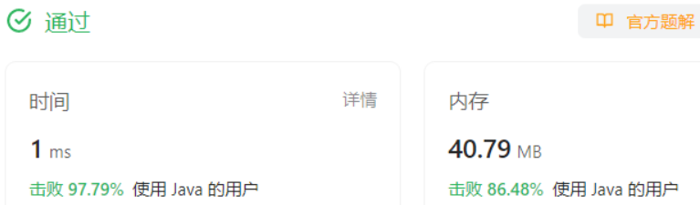

### 双指针基础知识（第 12 \~ 13 天）

#### 对撞指针

一个从头往后走，一个从后往前走,最好是有序的数组。
一般结束的条件就是两个指针相遇，也就是遍历了一次数组。

##### 适用范围

* 查找有序数组中满足某些约束条件的一组元素问题：比如二分查找、数字之和等问题。
* 字符串反转问题：反转字符串、回文数、颠倒二进制等问题。

##### 167. 两数之和 II - 输入有序数组 - 力扣（LeetCode）

给定一个下标从 1开始计数、升序排列的整数数组： 和一个目标值 target。

思路：这题目已经做过了，target = 小 + 大，因此将小初始化成最小，大初始化成最大。利用数组的有序特点，这是一个对撞指针的经典题目。

##### 2.5 验证回文串

回文串：正着读和反着读都一样的字符串。
另一种说法是，第一个和最后一个相同，第二个和倒数第二个相同.....
这样一来，使用对撞指针的思路就很明确了。

题目的输入数据是要转成统一大小写，保留下的是字母和数字。需要一点预处理

````java
class Solution {
    public boolean isPalindrome(String s) {
        // 将所有大写字符转换为小写字符、并移除所有非字母数字字符之后
        StringBuffer bf = new StringBuffer();
        for(char c : s.toUpperCase().toCharArray()){
            if(Character.isLetterOrDigit(c)){
                bf.append(c);
            }
        }
        int low = 0, high = bf.length() - 1;
        while(low <= high){   //两个指针可以相遇，但不能超过
            if(bf.charAt(low++) != bf.charAt(high--)){
                return false;
            }
        }
        return true;
    }
}
````

#### 2.6 **盛最多水的容器**

找出其中的两条线，使得它们与 x **轴共同构成的容器可以容纳最多的水**
思路：
建筑最大值，一般来说遍历是肯定需要的，但是遍历的方向是什么？先找一个起始，这里选择的就是宽度最大的时候，即一个挡板在最左边，一个在最右边。又是对撞指针。不过这里两个指针不是同时移动了。因为宽度变小，容量是会变小的，要想获得更大的容量，**只能让更小的挡板可能性地变大――移动更小的板。**
过程描述：
两个指针，起始位于数组两个端点，记录当前容量，每次迭代让最小的档板向中间方向移动，每次检查更新最大容量，直接两个指针相遇，退出循环。

```java
class Solution {
    public int maxArea(int[] height) {
        int low = 0, high = height.length - 1;
        int v = 0;
        while(low < high){ // 两个相遇宽度已经为0
            v = Math.max(v, Math.min(height[low], height[high]) * (high - low));
            if(height[low] < height[high]){   // 小的板移动
                low++;
            }else{
                high--;
            }
        }
        return v;
    }
}
```

#### 快慢指针

两个指针移动的方向相同。
快慢指针一般用于处理数组中的移动、删除元素问题，或者链表中的判断是否有环、长度问题。

##### 3.4 删除有序数组中的重复项

在原本的理解中，我是认为一个指针用来访问，一个指针用来指示元素存放位置，由于被访问过的元素没有必要保留，所以可以直接使用原来的数组。这种形式也被称为快慢指针，总之，两个指针分担不同的角色。
原本数据中删除一个元素是要涉及移动的操作，现在变成了重新赋值出一个新的数组。

```java
class Solution {
    public int removeDuplicates(int[] nums) {
        if(nums.length == 1){return 1;}
        int low = 1;     //不重复的元素存放的位置
        int fast = 1; // 第一个元素肯定要放下的
        int k = 1;
        while(fast < nums.length){
            if(nums[fast] != nums[fast - 1]){
                nums[low++] = nums[fast++];
                k++;
            }else{    //遇到重复元素直接往前
                fast++;
            }
        }
        return k;
    }
}
```

#### 4. 分离双指针

两个指针在不同的数组中移动，比方说，归并排序中的两个有序合并成一个有序。
代码模板里说：

* 明确什么时候两个指针一起前进
* 什么时候其中一个单独前进

##### 4.4 两个数组的交集

定两个数组，返回两个数组的交集。重复元素只计算一次。

需要对两个数组进行排序。从头开始遍历

* 如果两个元素相等，就同时前进一步(判断当前元素是否已经被记录)
* 否则让较小的指针前进，进行下一次循环
* 直到一个指针走到尾了，就能退出循环了，另一个数组完没完无所谓了。

```java

class Solution {
    public int[] intersection(int[] nums1, int[] nums2) {
        Arrays.sort(nums1);
        Arrays.sort(nums2);
        int[] res = new int[Math.max(nums1.length, nums2.length)];
        int left = 0, right = 0, index = 0;
        while(left < nums1.length && right < nums2.length){
            if(nums1[left] == nums2[right]){
                if(index == 0 || nums1[left] != res[index - 1]){
                    //未被记录过
                    res[index++] = nums1[left];
                }
                left++;right++;
            }else if(nums1[left] < nums2[right]){
                left++;
            }else{
                right++;
            }
        }
        return Arrays.copyOfRange(res, 0, index);
    }
}
```

### 练习题目（第 12 天）

#### 1.0344. 反转字符串

给定一个字符数组 。将其反转.不能使用额外的数组空间，必须原地修改输入数组

#### M:

跟判断回文串的思路是一样的，将字符串看成是数组，两个指针一个在头，一个在尾。。。
（对撞指针）

#### C:

```java
class Solution {
    public void reverseString(char[] s) {
        int left = 0, right = s.length - 1;
        while(left < right){ //两个指针相遇的那个字符可以不用操作了
            char temp = s[left];
            s[left] = s[right];
            s[right] = temp;
            left++;right--;
        }
    }
}
```


#### 2.0345. 反转字符串中的元音字母

给定一个字符串 。

要求：将字符串中的元音字母进行反转。

元音字母包括 'a'、'e'、'i'、'o'、'u'，且可能以大小写两种形式出现不止一次。

#### M:

跟上一题的思路一样，想反转那肯定是需要两个指针的。不同的点在于找到下一个需要反转的位置。也就是说，left需要去寻找下一个需要反转的位置，right也需要，在上一题中他们的下一个位置就是相邻的下一个格子。
也就是说，他们各自需要一个while去寻找下一个元素（是元音的字符）。
（对撞指针）

#### C:

我将判断是元音封装成一个方法

```java
class Solution {
public String reverseVowels(String s) {
char\[] str = s.toCharArray();
int left = 0, right = str.length - 1;
while(left < right){ // 相遇就不用
// left寻找需要反转的地方
while(left < right && !checkChar(str\[left])){left++;}
// right寻找需要反转的地方
while(left < right && !checkChar(str\[right])){right--;}            char temp = str[left];
            str[left] = str[right];
            str[right] = temp;
            left++;right--;
        }
        return new String(str);
    }
    public boolean checkChar(char c){
        // 将字符转换为小写以进行比较
        char lowercaseC = Character.toLowerCase(c);        // 使用条件语句检查字符是否为元音字母
        if (lowercaseC == 'a' || lowercaseC == 'e' || lowercaseC == 'i' || lowercaseC == 'o' || lowercaseC == 'u') {
            return true;
        } else {
            return false;
        }
    }
```


#### 3.0015. 三数之和

##### 3.1 题目大意

**描述：** 给定一个整数数组 。
**要求：** 判断  中是否存在三个元素 a, b, c, 满足a + b + c = 0。找出所有满足要求，不重复的三元组

##### M：

两数和的时候，由于数组有序，所以可以比较好地判断左右两个指针应该谁去移动。因此，先将数组排序，这样也比较好满足题目说不重复三元组的要求。将题目转化成 A + target = 0
target = b + c。bc的搜索范围是A 的右边。由于是有序的，所以这部分可以套用两数和的做法。
有一个问题是需要元组去重。【-1，-1，0，1】
如果按上面的搜索方法，会得到两个\[-1,0,1]，虽然两个-1分别指代不同位置的元素，但是元组的结果是一样的。

由于三元组都是有序的，所以我可以方便地比较两个三元组是否相等。
（对撞指针）

###### GPT的改进意见：

* 不要做List的比较，费时间。
* a元素的选择的时候应该去重，跳过那些重复的。
* 同样，在找到a，b，c之后 ，b，c也一样跳过那些重复的，这样一来就不用做List元组的去重

##### C：

```java
class Solution {
    public List<List<Integer>> threeSum(int[] nums) {
        Arrays.sort(nums);
        int a = 0;
        int top = -1; // res的栈顶
        List<List<Integer>> res = new ArrayList<List<Integer>>();
        while(a < nums.length - 2){ // 留下bc的空间
            if(a == 0 || nums[a] != nums[a - 1]){ // 跳过重复的a
                //寻找（a,b,c）
                int b = a + 1, c = nums.length - 1;
                while(b < c){
                    int sum = nums[a] + nums[b] + nums[c];
                    if(sum == 0){
                        res.add(Arrays.asList(nums[a], nums[b], nums[c]));
                        //跳过重复的b，c
                        while(b < c && nums[b] == nums[b + 1]) b++;
                        while(b < c && nums[c] == nums[c - 1]) c--;
                        b++;c--; // 下一个不相等b c的位置
                    }else if(sum < 0){
                        b++;
                    }else{
                        c--;
                    }
                }
                //所有（i, X,X）都找完了
            }
            a++;
        } 
        return res;
    }

}
```


时间还是不好呀。

### 练习题目（第 13 天）

#### 1.0027. 移除元素

1.1 题目大意
描述：给定一个数组 ，和一个值 val。

要求：不使用额外数组空间，将数组中所有数值等于 val值的元素移除掉，并且返回新数组的长度。

#### M:

按照去重的标准做就好了，两个指针，一个遍历访问，一个指示覆写的位置
最后指针的位置正好是需要返回的长度
(快慢指针)

#### C:

```java
class Solution {
    public int removeElement(int[] nums, int val) {
        int slow = 0, fast = 0;
        while(fast < nums.length){
            if(nums[fast] != val){
                nums[slow++] = nums[fast];
            }
            fast++;
        }
        return slow;
    }
}
```


#### 2.0080. 删除有序数组中的重复项 II

##### 2.1 题目大意

**描述：** 给定一个有序数组 。

**要求：** 在原数组空间基础上删除重复出现 次以上的元素，并返回删除后数组的新长度。

#### M:

在之前的基本思路上，加上一些改动。需要一个计数器，计算重复了几次。如果当前元素跟前一个元素不一样，计数设置成一。如果一样计数器加一（并且当前元素录入）。如果跟前一个一样，计数器显示为2，fast就跳过这个元素。

(快慢指针)

#### C:

```java
class Solution {
    public int removeDuplicates(int[] nums) {
        //输入是 1 <= length，放心地从第二个元素开始
        int slow = 1, fast = 1, count = 1;
        while(fast < nums.length){
            if(nums[fast] != nums[fast - 1]){ // 跟前一个不一样就重新计数
                nums[slow++] = nums[fast];
                count = 1;
            }else{
                if(count < 2){ // 还没记录过2次
                    nums[slow++] = nums[fast];
                    count++;
                }else{
                    // 已经被记录过2次了
                  
                }
            }
            fast++; //不管什么情况都要前进
        }
        return slow;
    }
}
```


#### 3.0925. 长按键入

#### 3.1 题目大意

**描述：** 你的朋友正在使用键盘输入他的名字。偶尔，在键入字符时，按键可能会被长按，而字符可能被输入 次或多次。

现在给定代表名字的字符串 ，以及实际输入的字符串 。

#### M：

对于names.length <= typed.length, names的指针也要更慢才对。
需要想一下什么情况下，可以直接返回false。应该说下一个应该相等的字符不相等时，说明两个字符串不相等。
当下一个names的字符c与前一个不相同时，允许typed的指针跳过重复的字符，直到一个新的字符出现，然后比对c和新字符是否匹配，不匹配说明就不是名字的重复输入。
退出循环时，还要检查一下，看看是否匹配完，余下的字符是为重复的字符
（分组指针）

#### C：

```java
class Solution {
    public boolean isLongPressedName(String name, String typed) {
        char[] nameArr = name.toCharArray();
        char[] typedArr = typed.toCharArray();
        int left = 0, right = 0;   //left  - name, right - typed
        while(left < nameArr.length && right < typedArr.length){
            if(nameArr[left] != typedArr[right]){
                //当前元素不相等，肯定不是手抖串
                return false;
            }else{
                left++;right++;  //匹配！两个指针共同前进
                if(left < nameArr.length && nameArr[left] != nameArr[left - 1]){
                    // 如果当前name字符不需要跟前一个相同，
                    //可以让typed跳到下一个不同字符(因为当前字符可能 是前一个的重复)
                    while(right < typedArr.length && typedArr[right] == typedArr[right - 1]) right++;
                }
            }
        }
        if(left < nameArr.length){
            //输入不够，肯定不匹配
            return false;
        }
        while(right < typedArr.length){
            //多余下的字符必须是同一个字符
            if(typedArr[right] != typedArr[right - 1]) return false;
            right++;
        }
        return true;
    }
}
```


### 滑动窗口基础知识（第 14 天）

固定长度窗口：窗口大小是固定的。
不定长度窗口：窗口大小是不固定的。

* 求解最大的满足条件的窗口。
* 求解最小的满足条件的窗口。
  两个指针框起来的范围就是一个窗口，适合求解连续子数组（子序列）的题目。
  问题的关键点就是寻找到两个指针移动的逻辑。

#### 3. 固定长度滑动窗口

##### 3.3 大小为 K 且平均值大于等于阈值的子数组数目

#### 3.3.2 题目大意

**描述：** 给定一个整数数组 和两个整数  和  。

**要求：** 返回长度为  且平均值大于等于 的子数组数目。

#### M：

#### C：

固定长度的窗口，按要求模拟窗口移动即可。
维护窗口内的总和sum即可。

```java
class Solution {
    public int numOfSubarrays(int[] arr, int k, int threshold) {
        // 1 <= arr[i] <= 104
        int left = 0, right = 0, sum = 0, res=0;
        while(right < arr.length){
            sum += arr[right];
            if(right - left + 1 >= k){ // 当前长度=K
                if(sum >= k * threshold) res++;
                sum -= arr[left++];
            }
            right++;
        }
        return res;
    }
}
```

#### 4. 不定长度滑动窗口

#### 4.3无重复字符的最长子串

**描述：** 给定一个字符串 。

**要求：** 找出其中不含有重复字符的最长子串的长度。
只要无重复，right就一直读取，反之计算长。left一直前进，退掉字符，直到退掉right处这个重复的字符，然后right可以继续前进。重复过程。
需要哈希来记录一下出现的字符。

#### C：

```java
class Solution {
    public int lengthOfLongestSubstring(String s) {
        char[] str = s.toCharArray();
        // 创建一个HashMap来存储字符和它们的计数
        Map<Character, Integer> charCountMap = new HashMap<>();
        int left = 0, right = 0; //0 <= s.length <= 5 * 104
        int max_length = 0;
        while(right < str.length){
            if(charCountMap.getOrDefault(str[right], 0) > 0){
                //出现重复 计算长度
                max_length = Math.max(max_length, right - left);
                // 退出重复的字符。
                while(str[left] != str[right]){
                    charCountMap.put(str[left], 0);
                    left++;
                }
                 //退出重复的字符, 该字符还是1次，在right处
                left++;
            }else{
                charCountMap.put(str[right], 1);
            }
            right++;
        }
        return Math.max(max_length, right - left);
    }
}
```

#### 4.5 乘积小于K的子数组

#### 4.5.1 题目链接

#### 4.5.2 题目大意

描述：给定一个正整数数组 和整数 。

要求：找出该数组内乘积小于  的连续的子数组的个数。

#### M:

当一个窗口内全部乘积小K，那么，从每个位置到right，形成的 这right - left + 1 个数组都昌符合要求的。
所以你每次寻找从left做为头的最长的符合要求的数组时，可以同时计算其它位置以left为起始的符合要求的数组。
挺难理解的。需要多想一会。。。。。

---

具体思路如下：

1. left,表示以left为起点的子数。right表示以left为起点，所以能达到的最大长度的数组的结尾。换句话说right要是再右移一步，left,right形成的数组就超K了。
2. 在left，right形成的这个窗口，以left为起点的数组，有right - left + 1,如果是左闭右开就是right - left.
3. 整个过程就是把每个left的都算完一次。
4. 每当一个left找到它的最长的right之后，计算一下总共几个。然后left前进一下，计算这个left的最大........

---

#### C:

这里编程的时候，子序列通常要考虑结尾是谁。所以上面的思路在编程的时候，实现做了改变，每次都计算以right结尾的窗口中，可以存在多少合法的解。因为以left为头的思路和以right为尾的思路其实是一样的。

```java
class Solution {
    public int numSubarrayProductLessThanK(int[] nums, int k) {
        //了序列问题一般关注点在结尾。
        // 以right结尾的，合法序列有多少个。
        int left = 0, right = 0, count = 0;
        int times = 1; // 表示窗口内的乘积[left, right]左闭右闭
        while(right < nums.length){
            times *= nums[right];
            while(times >= k && left <= right){ //当前以right结尾的窗口不满足条件。尝试寻找以right结尾的窗口，合法的总个数。
                times /= nums[left];
                left++;
            }
            count += right - left + 1; // 以right为结尾的合法的个数
            right++;
        }
        return count;

    }
}
```

### 练习题目（第 14 天）

#### 1.0643. 子数组最大平均数 I

#### 1.1 题目大意

**描述：** 给定一个由  个元素组成的整数数组 和一个整数 。

**要求：** 找出平均数最大且长度为
的连续子数组，并输出该最大平均数。

#### M:

经典的题目，固定长度的窗口。左右指针一起移动保持窗口长度不变。

(固定长度窗口)

#### C:

```java
class Solution {
   public double findMaxAverage(int[] nums, int k) {
       int left = 0, right = k;
       int sum = Arrays.stream(nums, 0, k) // 包括下标0，不包括下标5
               .sum();
       double avg = Arrays.stream(nums, 0, k) // 包括下标0，不包括下标5
               .average()
               .orElse(0.0); // 如果没有元素，默认返回0.0;
       while(right < nums.length){
           sum += nums[right++];
           sum -= nums[left++];
           avg = Math.max(avg, (double) sum / k);
       }
       return avg;      
   }
}
```


#### 2.0674. 最长连续递增序列

#### 2.1 题目大意

**描述：** 给定一个未经排序的数组 。

**要求：** 找到最长且连续递增的子序列，并返回该序列的长度。

#### M：

关于这题目，有许多类似的，什么最长山峰，最长摆动都是有点类似。

连续的子序列就是需要窗口，left，right起来的区域就是一个连续的子序列。

* 初始化，left right = 0   如果right可以递增（Nums\[right] > nums\[right - 1]），就让right一直前进，直到一个负增长出现.
* 计算一下长度。然后将left重置到right当前位置
* 重复过程

（变长窗口）

#### C：

注意是递增，所以下降和相等的进行要跳过

```java
class Solution {
    public int findLengthOfLCIS(int[] nums) {
        // 1 <= nums.length <= 10^4
        int left = 0, right =1, max_length = 1;
        while(right < nums.length){
            while(right < nums.length && nums[right] > nums[right - 1]) {right++;} //找到一个下降的点
            max_length = Math.max(max_length, right - left);
            // 找到下一个上升的点
            while(right < nums.length && nums[right] <= nums[right - 1]) {right++;}
            left = right - 1;
        }
        return max_length;
    }
}

```



#### 3.1004. 最大连续1的个数 III

#### 3.1 题目大意

**描述：** 给定一个由 、 组成的数组 ，再给定一个整数
k。最多可以将 k个值从 0变到1 。

**要求：** 返回仅包含 的最长连续子数组的长度。

#### M:

根据题意，变长的窗口。只要窗口里的0少于K个，right一直读取，直到遇到一个0，计算一下长度。然后right读取下一个0，left跟进直到弹出一个0

（变长窗口）

#### C:

全0 ，k= 0 这个样例，

```java
class Solution {
    public int longestOnes(int[] nums, int k) {
        // 1 <= nums.length <= 105
        int left = 0, right = 0, max_length = 0, count = 0; // 遇到的0
        while(right < nums.length){
            if(nums[right] == 0 && ++count > k){ //有逻辑中断
                max_length = Math.max(max_length, right - left);
                // left 弹出一个0 先找到下一个0在哪
                while(left <= right && nums[left] == 1) left++;
                left++; //跳过这个0
                count--;  //现在还是K个0
            }
            right++;
        }
        return Math.max(max_length, right - left); //结尾的还得算一次
    }
}
```


### 第一阶段小节

感觉双指针，对撞指针和快慢指针的题目还是好解的。唯一难的是如果题目的指针数增加到更多。比如3个，4个，就像快排里的一样，有些担任的角色是访问，有些是指向存储。。就不太好想了。
滑动窗口也一样，什么时候移动左右，更新的策略都是比较考验功力的。只能多遇题才行。
